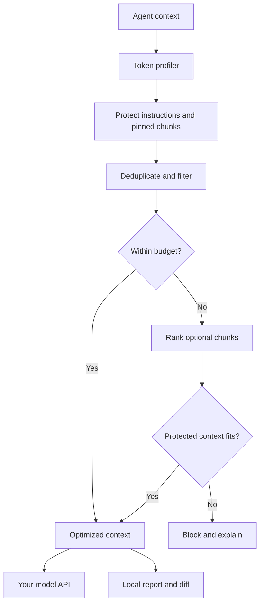

# TokenCut

Inspectable token optimization for AI agents. A local Python CLI and SDK that
profiles context, removes avoidable bulk, audits agent source, and shows its work.

**Goal: fewer tokens per successful task.** Cutting input in half is a target to
test, not a universal promise. Small, already-efficient prompts may not shrink.

## Quick Start

Python 3.10 or newer. From this project directory:

```bash
python -m venv .venv
source .venv/bin/activate
python -m pip install -e ".[tokens]"
tokencut profile examples/context.json --packet --counter tiktoken
tokencut optimize examples/context.json --counter tiktoken \
  -o optimized.json --report savings.json --diff changes.diff
tokencut audit examples/agent_before.py
tokencut bench --counter tiktoken
```

On Windows, activate with `.venv\Scripts\activate` instead. To run without
third-party packages or a network connection, use `python -m tokencut` from this
directory and select `--counter estimate`. No model API key is needed.

The optional tokenizer may download its encoding on first use. After caching,
tokenization is local. Profiling, optimization, auditing, and synthetic benchmarks
do not send input text to a model or analytics service. The optional live
evaluation command sends the selected task data to your model connection.

## What's Included

| Command | Purpose |
| --- | --- |
| `profile FILE --packet` | Count the canonical context packet and inspect chunk sizes. |
| `optimize FILE --budget 4000` | Compact and select context within the specified counting budget. |
| `request FILE --tool read_log=log` | Filter explicitly allowlisted tool outputs in a messages request. |
| `trim-log FILE` | Preserve detected errors, surrounding lines, query matches, and recent output. |
| `audit PROJECT` | Find potentially wasteful Python agent patterns, with source locations and suggestions. |
| `bench` | Run synthetic token-reduction and retention checks. |
| `eval --dry-run` | Plan a paired agent evaluation without a model connection. |
| `eval --model YOUR_MODEL` | Run baseline and optimized agents and compare correctness and total usage. |

All input commands accept `-` for stdin. Optimized payloads go to stdout by default;
diagnostics go to stderr. Optimized payloads have no extra whitespace appended.
Reports and diffs are separate and must not be included
in the model prompt. Existing output files require `--force`; inputs cannot be
overwritten even with that flag. Parent output directories must already exist.

Exit codes: `0` success, `1` failed audit threshold, benchmark check, or evaluation gate, `2` invalid
input or I/O error, `3` protected context cannot fit the budget.

## Runtime Flow



This is deterministic, extractive context optimization, not an LLM summarizer.
No model call is needed to perform compression. Instructions and query text are
immutable. Pinned chunks are never rewritten or removed.

## Context Format

```json
{
  "query": "Why are payment retries failing?",
  "instructions": ["Preserve the public API."],
  "chunks": [
    {
      "id": "retry-contract",
      "text": "Retries must reuse the original idempotency key.",
      "kind": "text",
      "pinned": true,
      "source": "docs/retries.md"
    }
  ]
}
```

Supported kinds: `text`, `code`, `json`, `log`. Chunk IDs must be unique. Unknown
fields are rejected, so unrecognized constraints are not silently discarded.

- `text` and `code`: never rewritten; optional whole chunks can be dropped for a budget.
- `json`: only whitespace outside strings is removed. Numeric spelling, key order,
  duplicate keys, and string content are preserved. Invalid JSON is kept unchanged.
- `log`: explicitly lossy, with omission markers. Detected error windows and Python
  traceback bodies are retained. A log chunk with a detected error becomes
  mandatory for budget selection. Error detection is heuristic; pin a log to keep all of it.
- Exact duplicate chunks with the same kind, source, and text are deduplicated;
  pinned copies always survive. IDs identify context chunks, not independent events.
  Use distinct `source` values or `--no-dedupe` when identical text has distinct meaning.

Selection uses English-oriented keyword overlap weighted by rarity, not embeddings.
It only removes optional chunks when the budget requires it. The output preserves
the original relative order. Instructions, query, serialized framing, and protected
chunks all count toward the budget. A relevant chunk that is too large may be omitted;
provide function-sized or section-sized chunks and pin indispensable evidence.

`--no-log-filter` disables log trimming. `--no-dedupe` disables deduplication.
Pinning disables every transformation on that chunk. A report's `risk` is a category
(`none`, `structural`, `lossy`), not a probability or quality guarantee.

## Python SDK

```python
from tokencut import Chunk, ContextPacket, TokenCounter, optimize

packet = ContextPacket(
    query="Diagnose the timeout",
    instructions=("Never expose credentials.",),
    chunks=(
        Chunk("contract", "Do not change the public API.", pinned=True),
        Chunk("logs", log_text, kind="log", source="test-run-123"),
    ),
)
result = optimize(packet, budget=4000, counter=TokenCounter("tiktoken"))
context_for_model = result.render()
local_report = result.report
```

Place optimized context at its existing trust level in your agent. Retrieved text
and tool output must not become system/developer instructions. Keep your actual
system/developer messages outside this packet. This tool is not a prompt-injection
defense or a secrets redactor.

### Existing Message Requests

```python
from tokencut import TokenCounter, optimize_request

result = optimize_request(
    request_body,
    tool_kinds={"read_log": "log", "fetch_metadata": "json"},
    counter=TokenCounter("tiktoken"),
)
optimized_request_body = result.request
```

The adapter takes a deep copy. Only string content on `role="tool"` messages
belonging to explicitly listed tools may change. It resolves tool names from
preceding assistant tool-call IDs or an explicit tool-message name. It preserves
all other messages, tool-call IDs, arguments, schemas, metadata, and request keys.
Multimodal content is untouched. No conversation turn is dropped or summarized.
The adapter supports the `messages` request shape, not every provider's input format.
It does not enforce a global model budget or send the request itself.

## Agent Code Audit

Audits parse Python with the standard-library AST and never import or execute
the project. Findings are review suggestions, not proof that waste reaches a model.
For example, upstream code may already have bounded a `history` variable.

| Rule | Pattern |
| --- | --- |
| `TC000` | Source could not be parsed; audit coverage is incomplete. |
| `TC001` | A history-like variable is passed directly to a model-like call. |
| `TC002` | A model-like call is inside a loop. |
| `TC003` | Unbounded file or stream read. |
| `TC004` | Pretty-printed JSON that might reach a prompt. |
| `TC005` | Captured subprocess output that may need filtering. |
| `TC006` | Large embedded string that may be resent. |

Use `--exclude 'tests/*'` for relative path globs and `--fail-on warning` for CI.
Suppress a reviewed finding with an inline comment such as
`# tokencut: ignore[TC004]`. Dependencies, virtual environments, symlinks, and
files over 1 MiB are skipped; unreadable/skipped files are reported.

For a review-only patch preview of a simple model-facing pretty JSON call, run
`tokencut fix agent.py --rule TC004`. It writes a unified diff and never edits
the source. Multi-line calls, comments inside calls, and calls that already set
`separators` are skipped for manual review.

There is intentionally no automatic source rewrite in v0.2. Dropping history,
changing tool output, or altering a loop requires behavioral tests and approval.
JavaScript/TypeScript auditing is not implemented yet.

## Measurement, Not Marketing

```bash
tokencut bench --counter tiktoken --runs 5 --format json -o benchmark.json
```

The built-in suite includes noisy logs, verbose JSON, duplicated context,
budgeted retrieval, and an already-lean case that should save zero tokens.
It checks selected sentinel strings and protected context. These checks do not
prove model task quality. Every report explicitly sets `quality_verified: false`.

For your own fixtures, `--suite cases.json` accepts an array like:

```json
[
  {
    "name": "my-agent-task",
    "packet": {"query": "Diagnose retries", "chunks": []},
    "budget": 2000,
    "must_keep": ["Diagnose retries"]
  }
]
```

Real acceptance requires running the same tasks before and after optimization,
with the same model/settings and task-level tests. Measure task success, total
input/output/reasoning tokens where available, retries, and latency, including any
future compressor-model calls. A shorter prompt that causes extra retries can cost more.

The `tiktoken` counter is exact for the **serialized text and selected encoding**,
not for a provider's entire request accounting. Choose the encoding used by your
model. Chat framing, images, hidden reasoning, caching, and billing are separate.
The fallback uses UTF-8 bytes / 4 and is explicitly approximate; its budget is not
a hard model-token limit. Cached tokens can reduce cost without reducing token count.

## Live Evaluation

Version 0.2 includes a read-only demo agent that chooses tools and returns a
structured answer. The evaluator runs each task with and without TokenCut,
checks correctness, and counts provider-reported usage across every model call.

```bash
python -m pip install -e ".[tokens,live]"
tokencut eval --dry-run
python examples/run_live_eval.py
```

The launcher prompts for your model name and API key locally with hidden key
input. Nothing live has been measured in this package: no model connection was
configured in the build workspace. The [evaluation guide](EVALUATION.md) covers
custom tasks, limits, scoring, reports, and existing-agent integration boundaries.

## Development

```bash
python -m pip install -e ".[tokens,live,dev]"
python -m unittest discover -s tests -v
ruff check .
python -m build
```

Tests cover protocol preservation, protected context, failed budgets, numeric and
Unicode preservation, malformed input, audit safety, CLI output, and randomized
budget invariants. The repository includes a CI workflow and an MIT license.

## Next Milestones

1. Run paired evaluations against real task fixtures and production acceptance tests.
2. Add AST-based repository maps and JavaScript/TypeScript source auditing.
3. Generate reviewable agent-code patches with test execution and rollback.
4. Add session memory and repeated-tool-call detection with explicit freshness rules.

References: [tiktoken](https://github.com/openai/tiktoken) for tokenizer usage;
[Python AST](https://docs.python.org/3/library/ast.html) for structural source parsing.
